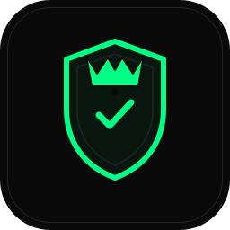
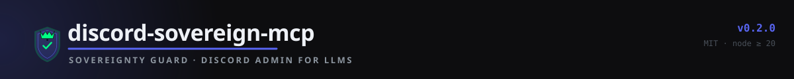
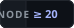
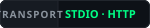

<p align="center">
  
</p>

<h1 align="center">discord-sovereign-mcp</h1>

<p align="center">
  Full-lifecycle Discord MCP server — create, administer, and scaffold entire Discord servers
  from any LLM, gated by a <b>Sovereignty Guard</b> that only mutates when the client holds the
  <b>#1 (highest) role</b> in the guild's role hierarchy.
</p>

<p align="center">
  
</p>

<p align="center">
  
  
  
  
  = 20">
  
  
</p>

---

> **Why a sovereignty guard?** Discord's permission model is hierarchical: role *position*, not
> permission flags, decides who can do what. The single most common cause of
> `Missing Permissions` failures in LLM-driven admin bots is acting from a role that *thinks* it
> has permissions but sits below the roles it tries to manage. This server refuses to act until the
> client provably sits at the top of the ladder.

## One-click install

```bash
npx discord-sovereign-mcp@latest --install
```

That's it. The installer wires the server into **Claude Code, Claude Desktop, Codex, opencode,
Cursor, Windsurf, Continue, Google Antigravity, and VS Code** — interactive picker by default,
`--all` if you want everything, backups before every write, idempotent on re-run.

- `npx discord-sovereign-mcp@latest --install --all` — every client, no prompts
- `npx discord-sovereign-mcp@latest --install --client codex,opencode --dry-run` — preview
- Full guide: [docs/INSTALL.md](./docs/INSTALL.md)

Prefer manual setup? Copy the ready-made config for your client from
[examples/mcp/](./examples/mcp) — every file, every client, the same `npx` invocation.

## What you get

- **46 tools** across six areas — control, guilds, channels, members, scaffolding, OAuth — all
  snake_case, `discord_`-prefixed, schema-strict, and documented in [TOOLS.md](./TOOLS.md).
- **Sovereign Control Guard**: every destructive tool is `dry_run` by default and must pass
  `discord_assert_sovereignty` before executing with `dry_run: false` — enforced on the server
  side, not just in prompts.
- **One-shot server scaffolding** (`discord_scaffold_server`): roles, categories, channels, and
  permission overwrites from a declarative template (minimal / community / gaming / support), with
  guard-once, per-step failure isolation, and partial-failure reconciliation output.
- **OAuth2 bootstrap** for user-token mode (`npx discord-sovereign-mcp --oauth`), plus a built-in
  `/callback` handler when running over HTTP transport.
- **Both transports**: stdio (MCP clients) and Streamable HTTP (`POST /mcp`, `GET /health`).
- **Safety rails**: guild allowlist (`DISCORD_ALLOWED_GUILDS`), audit-log reasons, idempotency
  checks, `dry_run` previews that return the exact API payload, and a read-only permission
  calculator/auditor.

## Quick start

```bash
# Option A — run directly (OAuth2 user-token bootstrap included)
npx discord-sovereign-mcp@latest --oauth

# Option B — from source
npm install
cp .env.example .env        # then edit: DISCORD_TOKEN (or OAuth2 vars)
npm run build
npm test                    # 80 unit tests
```

### Option A — bot token (recommended for servers you own)

1. Create an application at <https://discord.com/developers/applications>.
2. Under **Bot**: create the bot, copy the token, enable **SERVER MEMBERS INTENT** and
   **MESSAGE CONTENT INTENT**.
3. Under **OAuth2 → URL Generator**: scope `bot`, permissions `Administrator`, invite the bot to
   your server. (Administrator is required for server-scoped operations; the guard still enforces
   role position.)
4. `DISCORD_TOKEN=<token>` in `.env`, `DISCORD_TOKEN_TYPE=bot` (or `auto`).

### Option B — user token via OAuth2

1. Create an application; under **OAuth2 → General** add a redirect
   `http://localhost:8788/callback`.
2. Set `DISCORD_OAUTH2_CLIENT_ID`, `DISCORD_OAUTH2_CLIENT_SECRET`,
   `DISCORD_OAUTH2_REDIRECT_URI` in `.env`.
3. `npx discord-sovereign-mcp@latest --oauth` — opens the authorization URL, waits for the
   callback, and writes the user token into `.env` (`DISCORD_TOKEN_TYPE=oauth2`).

### Run

```bash
npm run dev            # tsx, stdio transport
npm run start          # built dist/, stdio transport
TRANSPORT=http npm run start    # HTTP transport (POST /mcp, GET /health)
```

## The Sovereignty Guard

- `discord_assert_sovereignty` — read-only verdict: prints the full role ladder with positions and
  flags the client role. Controlled = client owns the guild (user mode) **or** holds the #1 role
  (bot mode).
- `discord_elevate_control` — moves the client role to the top of the ladder, then re-verifies.
  Never fails silently: if the API rejects the reorder, the error explains that a human must drag
  the role above the roles it couldn't outrank.
- Every destructive tool runs the same gate (`assertControl`) before its first mutating call when
  `dry_run: false` — awaited server-side, so a guard failure can never be dropped.

## Scaffolding

`discord_scaffold_server` builds a whole server from a template in one call:

```jsonc
{
  "guild_id": "1234567890",
  "template": "community",          // minimal | community | gaming | support
  "dry_run": false
}
```

It executes in safe order — roles lowest-first, then categories, then channels (with parent
wiring), then permission overwrites — guarding **once** before the first step. Each step is
isolated: on failure the tool returns `steps_total / steps_completed / steps_failed` plus the
already-created role/channel IDs so a partial scaffold can be reconciled by hand.

## Architecture

```
┌────────────────────────────┐        ┌──────────────────────────────────────────┐
│  MCP client                │  MCP   │  discord-sovereign-mcp (Node 20+)          │
│  Claude Code / Codex /     │◄──────►│  stdio  or  Streamable HTTP (POST /mcp)    │
│  opencode / Cursor / ...   │        │                                           │
└────────────────────────────┘        │  registry ── 46 strict-zod tools           │
                                      │    │                                       │
                                      │    ▼                                       │
                                      │  guard() ── ControlService.assertControl  │
                                      │    │  owner? (user token)                  │
                                      │    │  #1 role? (bot token)                 │
                                      │    │  DISCORD_ALLOWED_GUILDS?               │
                                      │    ▼                                       │
                                      │  DiscordClient ── @discordjs/rest REST API │
                                      │  PermissionService (read-only auditor)     │
                                      │  ScaffoldService (template planner)        │
                                      │  OAuthService (user-token bootstrap)       │
                                      └──────────────────────────────────────────┘
```

## Environment variables

| Variable | Default | Description |
| --- | --- | --- |
| `DISCORD_TOKEN` | — | Bot or OAuth2 user token (required). |
| `DISCORD_TOKEN_TYPE` | `auto` | `auto` \| `bot` \| `oauth2` \| `user`. `auto` detects bot vs user from the token. |
| `DISCORD_ALLOWED_GUILDS` | *(empty = all)* | Comma-separated guild IDs. When set, every tool refuses guilds outside the list — even if sovereignty is held. |
| `TRANSPORT` | `stdio` | `stdio` \| `http`. |
| `HTTP_HOST` / `HTTP_PORT` | `127.0.0.1` / `3000` | HTTP transport bind address/port. |
| `DISCORD_OAUTH2_CLIENT_ID` | — | OAuth2 application client ID. |
| `DISCORD_OAUTH2_CLIENT_SECRET` | — | OAuth2 application client secret. |
| `DISCORD_OAUTH2_REDIRECT_URI` | `http://localhost:8788/callback` | Must match the redirect registered in the Discord developer portal. |
| `DISCORD_OAUTH2_PORT` | `8788` | Local callback port used by `--oauth`. |
| `AUDIT_REASON` | `via discord-sovereign-mcp` | Audit-log reason stamped on actions. |
| `LOG_LEVEL` | `info` | `info` \| `debug` \| `warn` \| `error`. |

## AI client configs

| Client | Config file | Where it goes |
| --- | --- | --- |
| Claude Code | `claude-code.json` | `.mcp.json` at the repo root (or `~/.claude.json`) |
| Claude Desktop | `claude-desktop-config.json` | menu: Claude → Settings → Developer |
| Codex CLI | `codex-config.toml` | `~/.codex/config.toml` (user) or `.codex/config.toml` (project) |
| opencode | `opencode.json` | `opencode.json` in the project (or `~/.config/opencode/`) |
| Cursor | `cursor-mcp.json` | `.cursor/mcp.json` |
| Windsurf | `windsurf-mcp.json` | `.windsurf/mcp_config.json` |
| Continue | `continue-config.json` | `~/.continue/config.json` |
| Google Antigravity | `antigravity-config.json` | Project MCP settings |

Ready-to-paste files: [examples/mcp/](./examples/mcp). Every client invokes the server the same
way: `npx discord-sovereign-mcp@latest`.

## Evaluation

```bash
npm run eval               # offline: registry invariants (no token, no network)
npm run eval -- --live     # spawns dist/ and runs protocol-level checks against real Discord
```

## Project layout

```
src/
  index.ts                 # entrypoint: stdio + HTTP transports, /health, /callback, --install
  config.ts                # typed env config + guild allowlist
  constants.ts             # server identity, permission/color constants
  bootstrap/               # one-shot CLI: installer (--install), OAuth bootstrap (--oauth)
  client/                  # Discord REST client + error translation
  services/                # control (sovereignty), permissions, scaffolding, OAuth
  tools/                   # 46 RegisteredTools + registry wiring + shared zod schemas
  utils/                   # formatting (bigint-safe JSON)
tests/                     # vitest suite (80 tests)
scripts/                   # oauth bootstrap, eval runner, docs generator
```

## Development

```bash
npm run typecheck   # tsc --noEmit
npm run test        # vitest run
npm run test:watch
npm run test:coverage
npm run install:mcp # run the installer locally (tsx)
npm run oauth       # OAuth2 user-token bootstrap
npm run eval        # offline registry checks (add --live for protocol checks)
npx tsx scripts/gen-tools-doc.ts   # regenerate TOOLS.md
```

## Docs

- [TOOLS.md](./TOOLS.md) — full reference for all 46 tools (generated).
- [docs/INSTALL.md](./docs/INSTALL.md) — the installer: flags, token resolution, what gets written.
- [docs/SPEC.md](./docs/SPEC.md) — design spec: threat model, guard semantics, tool contracts.
- [docs/RECIPES.md](./docs/RECIPES.md) — end-to-end recipes for common workflows.
- [SECURITY.md](./SECURITY.md) — threat model, token handling, and reporting policy.

## License

MIT — see [LICENSE](./LICENSE).